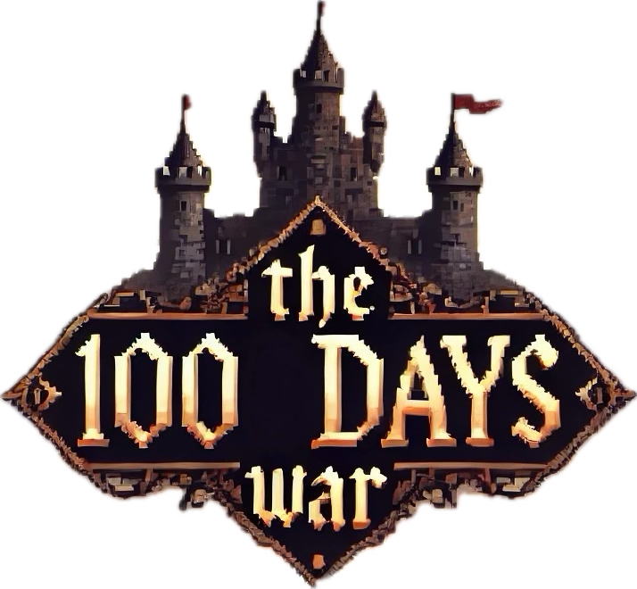
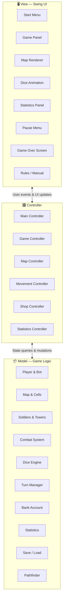

<p align="center">
  
</p>

<h1 align="center">⚔️ 100 Days War</h1>

<p align="center">
  <em>A turn-based strategy game inspired by <a href="https://www.conq.io/">Conq.io</a>, built with Java &amp; Swing.</em>
</p>

<p align="center">
  <a href="LICENSE"></a>
  <a href="https://www.java.com/"></a>
  <a href="https://gradle.org/"></a>
</p>

---

## 📖 About

**100 Days War** is a simplified, single-player strategy game where the player competes against an AI bot on a procedurally generated map. Each match spans **100 virtual days** — every day is simulated within a few seconds — and the goal is to conquer the opponent's spawn cell or control the most territory by the end of the war.

> **University project** — Developed by a team of four for the *Object-Oriented Programming* course (A.Y. 2023/2024) in the [Bachelor's Degree in Computer Science and Engineering](https://corsi.unibo.it/laurea/IngegneriaScienzeInformatiche) at the [University of Bologna](https://www.unibo.it/).

### Repository provenance

**This repository is my personal copy of the [original team repository](https://github.com/Gianmarco-Fabbri/OOP23-100DaysWar), maintained by a fellow team member.** The game was a collaborative project, not an individual one. My contributions were the coin system and shop interface, game-map rendering, and tower interaction logic. The [Team & Contributions](#-team--contributions) section credits all four members.

---

## 🎮 How It Works

1. **🏁 Launch** — Enter a username, then choose to start a new game or load a previous save.
2. **🗺️ Map Generation** — A procedurally generated grid assigns spawn cells to the player and the bot.
3. **📅 Day Cycle** — The game runs for up to 100 days. If a player doesn't make a move for **4 consecutive days**, the turn automatically passes.
4. **💰 Economy** — Earn coins each turn to buy, place, or upgrade units.
5. **🛡️ Defense** — Build **defensive towers** (up to level 4) to protect your territory.
6. **⚔️ Offense** — Deploy and move **soldiers** (up to level 3) across the map.
7. **🎲 Combat** — When a soldier enters an enemy-occupied cell, combat is resolved via a **dice-roll system** scaled by each unit's level. Highest total wins.
8. **🏆 Victory** — Capture the opponent's spawn cell for an early win, or hold the most cells after 100 days.

---

## 🏗️ Architecture

The project follows the **Model-View-Controller (MVC)** architectural pattern, separating the interface, game controls and game state.



---

## ✨ Features

### Core Features

| Feature | Description |
|:--------|:------------|
| 🗺️ **Procedural Map** | Dynamically generated grid with spawn points and obstacles |
| 🤖 **AI Opponent** | Bot with strategic decision-making |
| ⚔️ **Dice Combat** | Level-scaled dice-roll battle resolution |
| 💰 **Economy System** | Coin-based purchasing and upgrading of units |
| 🛡️ **Tower Defense** | Multiple tower types with up to 4 upgrade levels |
| 🏃 **Soldier Movement** | Pathfinding-based soldier deployment and repositioning |
| 📊 **Live Statistics** | Real-time game stats displayed during play |
| 💾 **Save & Load** | Persist and resume your last game session |
| 📜 **In-Game Manual** | Detailed rules and gameplay guide |

### Optional / Bonus Features

| Feature | Description |
|:--------|:------------|
| 🏰 **Tower Variants** | Different defensive tower types with unique properties |
| 🧠 **Smarter Bot** | Enhanced AI strategy |
| ⭐ **Bonus Cells** | Special cells with unique effects on the map |

---

## 🚀 Getting Started

### Prerequisites

- **Java 17** or higher
- No separate Gradle installation is needed; the repository includes the Gradle wrapper.

### Run from Source

```bash
git clone https://github.com/Riccardo-Bartolini/OOP-100Days_War.git
cd OOP-100Days_War
./gradlew run
```

### Run the Pre-Built JAR

```bash
java -jar OOP23-100DaysWar-all.jar
```

### Build a Fat JAR

```bash
./gradlew shadowJar
# Output: build/libs/OOP23-100DaysWar-all.jar
```

---

## 🧪 Testing

The project includes **19 test classes** powered by JUnit 5.

```bash
./gradlew test
```

---

## 🤝 Team & Contributions

This project was developed by a team of four as part of a university course.

| Member | Responsibilities |
|:-------|:-----------------|
| **Bartolini** | 💰 Coin system & shop UI · 🗺️ Game map rendering · 🧩 Tower interaction logic |
| **Balzani** | 🖥️ Start menu UI · 🎲 Dice implementation · 💾 Save & load functionality · 🛡️ Tower system |
| **Fabbri** | 🏃 Soldier system & interactions · 🤖 AI bot · 📊 Real-time statistics |
| **Francalanci** | ⚔️ Combat system · 📅 Turn management · 📜 In-game manual · 🏆 End-game logic |

### 💰 Bartolini

**Riccardo Bartolini** — [@Riccardo-Bartolini](https://github.com/Riccardo-Bartolini)

- Implemented the **coin system**, related shop menu and its display in the main game panel.
- Implemented and rendered the **game map**.
- Implemented the **tower interaction** logic.

### 🖥️ Balzani

**Riccardo Balzani** — [@FrittatinaDiBucatini09](https://github.com/FrittatinaDiBucatini09)

- Implemented and rendered defensive towers, the dice system and the start menu.
- Managed game save and load functionality.

### 🏃 Fabbri

**Gianmarco Fabbri** — [@Gianmarco-Fabbri](https://github.com/Gianmarco-Fabbri)

- Implemented and rendered soldiers and their interactions.
- Implemented the AI bot opponent and real-time game statistics.

### ⚔️ Francalanci

**Filippo Francalanci** — [@FrancalanciFilippo](https://github.com/FrancalanciFilippo)

- Implemented soldier combat and turn progression.
- Implemented the in-game rules manual and end-of-game conditions.

---

## 🏛️ Key Design Challenges

- Applying the **MVC pattern** across the game.
- Coordinating development and Git work across four team members.
- Dividing features into modules that could be developed in parallel.
- Tuning the day-cycle speed for gameplay.

---

## 📄 License

This project is licensed under the **MIT License** — see the [LICENSE](LICENSE) file for details.

---

<p align="center">
  Made with ❤️ at the University of Bologna
</p>
